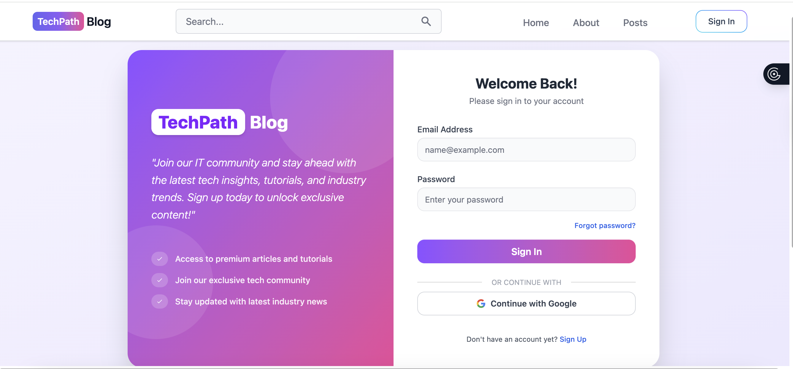
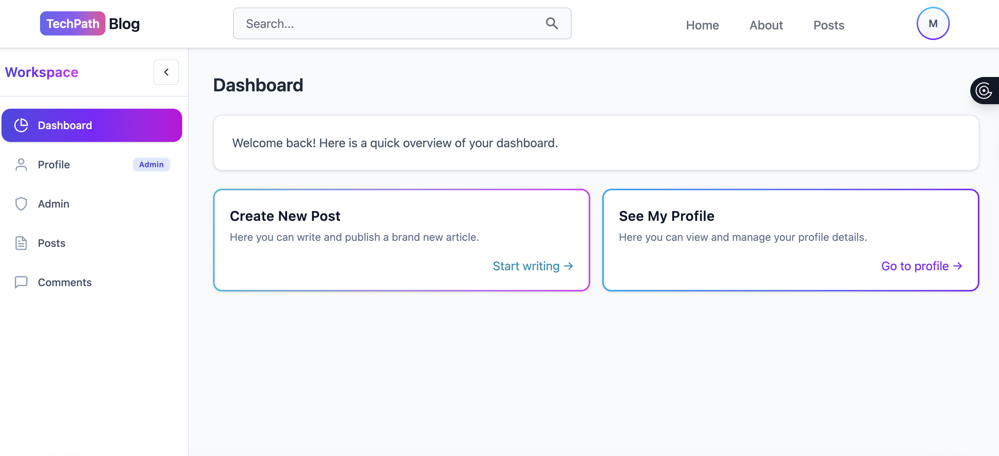
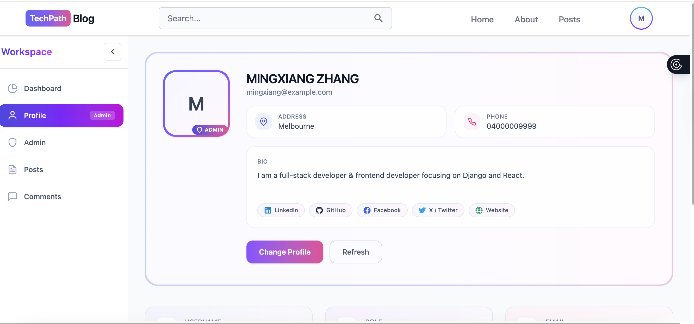
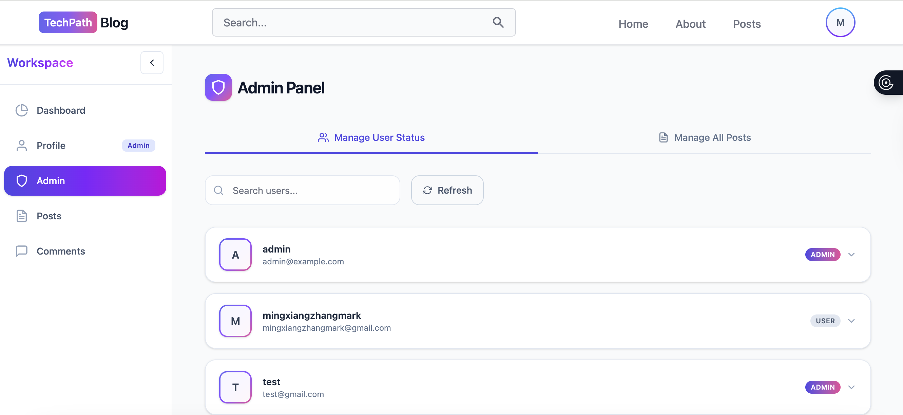
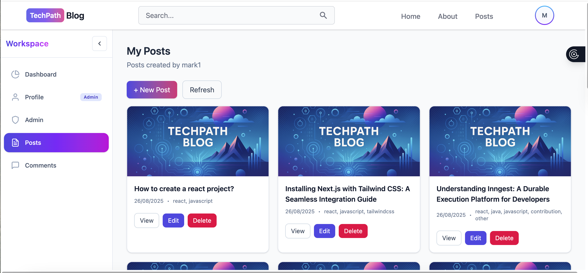

# 🧭 TechPath Blog — Django Web Application

TechPath Blog is a **technical knowledge-sharing platform** where users can create, tag, and interact with posts through likes and comments.
It also integrates **AI-powered content recommendations** and provides an **admin dashboard** for platform management.

---

## 🚀 Features

### User Management

* Register, login, logout
* Password recovery using security questions
* Profile customization (avatar, bio, social links, etc.)
* “My Posts” & “My Comments” pages

### Post System

* Create, edit, delete, and view posts
* Tagging system with predefined technical topics (auto-created at startup)
* AI-generated content suggestions when writing posts
* Real-time like system (one like per user per post)
* Comment system with edit/delete support

### Admin Features

* Admin dashboard for monitoring user and post activities
* Manage users (search, update status, delete)
* Manage posts (review, edit, delete)

---

## 🧩 Data Model Overview

| Model                                     | Description                                                                                        |
| ----------------------------------------- | -------------------------------------------------------------------------------------------------- |
| `CustomUser`                              | Extended from Django `AbstractUser`; adds `email`, `address`, `phone_number`, and `is_admin_user`. |
| `Profile`                                 | One-to-one relation with `CustomUser`; stores avatar, bio, and social links.                       |
| `Post`                                    | Blog post with `title`, `content`, `tags`, `cover`, and publication info.                          |
| `Tag`                                     | Unique tags used to categorize posts. Auto-slugified on save.                                      |
| `Comment`                                 | User comments linked to posts and authors.                                                         |
| `Like`                                    | Tracks post likes, enforcing uniqueness per (user, post).                                          |
| `SecurityQuestion` & `UserSecurityAnswer` | Used for password recovery validation.                                                             |

---

## ⚙️ Installation & Setup

### 1️⃣ Prerequisites

* Python 3.8+
* Node.js & npm
* Git
* pip
* Virtual environment tool (`venv` or `virtualenv`)
* (Optional) Redis server for caching (if enabled)

---

### 2️⃣ Clone Repository

```bash
git clone https://github.sydney.edu.au/2025S2-INTERNET-SOFTWARE-PLATFORM/Thu-13-16-7.git
````

---

### 3️⃣ Backend Setup

```bash
cd backend
```

#### (1) Setup Environment

Copy `.env.example` to `.env` and edit it with your preferred credentials:

```bash
cp .env.example .env  # macOS/Linux

# OR (Windows PowerShell)
copy .env.example .env
```

#### (2) Create Virtual Environment

```bash
python -m venv venv

source venv/bin/activate      # macOS/Linux
# OR
venv\Scripts\activate         # Windows
```

#### (3) Install Dependencies

```bash
pip install -r requirements.txt
```

#### (4) Initialize Database

Before running migrations, manually create the database named **`django_db`** in your PostgreSQL instance (or the database specified in your `.env`).

Then apply migrations:

```bash
python manage.py migrate
```

This automatically creates:

* Default tags (e.g., python, java, react, etc.)
* Default security questions
* A default admin account (`admin@example.com / admin123`)

#### (5) Run Backend Server

```bash
python manage.py runserver
```

Backend runs at: [http://127.0.0.1:8000/](http://127.0.0.1:8000/)

---

### 4️⃣ Frontend Setup

In a new terminal:

```bash
cd frontend
```

Copy `.env.example` to `.env` and edit it with your preferred credentials:

```bash
cp .env.example .env  # macOS/Linux

# OR (Windows PowerShell)
copy .env.example .env
```
Then

```bash
npm install
npm run dev
```

Frontend runs at: [http://localhost:5173/](http://localhost:5173/)

---

## 🧪 Testing the System

The project uses **pytest**, **pytest-django**, and **pytest-cov** for testing and coverage enforcement.

### Run All Tests

```bash
pytest
```

### Run With Coverage Report

```bash
pytest --cov=api --cov-report=term-missing --cov-report=html
```

Then open:

```bash
start htmlcov\index.html  # Windows
open htmlcov/index.html   # macOS
```

### Coverage Policy

`pytest.ini` enforces:

```ini
--cov=api
--cov-fail-under=80
```

Latest result:

```
TOTAL COVERAGE: 90%
```

---

## 🧰 Development Notes

* `signals.py` automatically creates:

  * `Profile` on new user registration
  * Default tags and security questions after migrations
* `startup.py` ensures a default superuser exists at startup.
* Use `python manage.py createsuperuser` to add more admin users.

---


```

## Pictures







